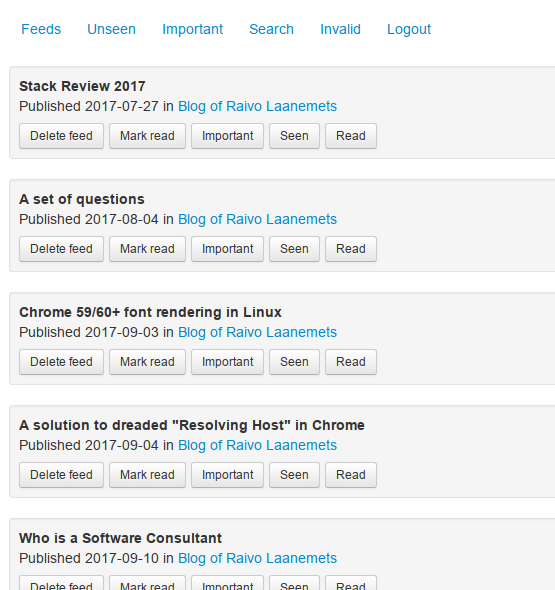

# Feeds

My personal web-based replacement for Google Reader (was shutdown) and
other feed readers. It tracks seen/read/important articles and is built for
speed. I currently follow about 600 feeds and other readers had trouble
coping with this amount of feeds.

## How does it work

The feed reader works differently to other similar applications. It only displays
item titles and assumes that an item title provides enough information to decide
whether you want or want not to read it. The actual article is displayed in a seperate
browser tab, in the case you decide to read it.

The main view of the application displays the list of "unseen" articles. These are
the fresh items from recently updated newsfeeds. Clicking "Seen" on an item will mark
it, and the previous items, as "seen". This allows to skip a large number of
uninteresting articles. This is what makes this app to scale to a very high number
of feeds without having too much cognitive overhead to mark things "read" manually
or have UI slow down to useless speed because you have too many feeds and articles.

The items appear in the "unseen" list by the order of publication date. The list
uses infinite scroll.

Read articles are also tracked. An article can be marked as "important" which is
displayed in the list of "important" articles.

Screenshot:



## How is it built

The application runs on NodeJS. Feeds are parsed with [fast-feed](https://github.com/rla/fast-feed)
which uses [RapidXML](http://rapidxml.sourceforge.net/) internally to parse the feed and extract
the interesting data.

The user interface uses a (custom) [Bootstrap](http://twitter.github.io/bootstrap/) stylesheet. I only
selected the parts of Bootstrap that I needed. SQLite is used as the database on the server side.

Since 2017-07-01, the user interface has been rewritten in React. There is no difference
in functionality compared to the previous versions, however. The previous user interface
was developed with Knockout.js.

My live app is running at [http://feeds.rlaanemets.com/](http://feeds.rlaanemets.com/).

## Installing

1.  First install dependencies using `npm install --production`.
2.  Then create database using `make db.sqlite`.
3.  Then copy `config.example.json` to `config.json`.
4.  Run app with `NODE_ENV=production node dist`.

## Importing feed addresses

Use the textarea on top of the "Feeds" list to enter a list of urls.
Invalid urls and feeds will later be shown under "Invalid". The urls have to point
directly to newsfeeds. The newsfeed urls are currently not extracted from
site urls!

## Technology

The project has become my personal playground to test various frontent (mostly) libraries.
The whole project is type-checked and compiled by TypeScript. This has made it easier to
refactor although it causes some friction with libraries that have no types available or
are very dynamic to have useful types.

### Architecture

The application is built as a Single Page Application (SPA) with a server-side
backend. The backend manages the database, fetches newsfeeds periodically, and
provides a REST API for the frontend.

Backend:

- [Express][express] web framework.
- SQLite database.
  - Uses package `node-sqlite` for Promise-based access.
  - Custom transaction manager in `src/lib/db`.
- [Fast-feed][fast-feed] RSS/Atom parser.
  - This package was developed for this application although
    it has been used by others too.

[express]: https://expressjs.com/
[fast-feed]: https://github.com/rla/fast-feed

Backend files:

- `src` - source tree (TypeScript).
- `src/index.ts` - application entrypoint.
- `Makefile` - helper to create an initial database state.
- `schema/schema.sql` - database schema.
- `schema/migrations` - migrations applied after the initial schema.

Frontend:

- React view library.
- Redux state store.
  - Uses package `redux-thunk` for async actions.
  - Typesafe actions, reducers, and state with TypeScript.
- Typesafe REST API with shared types between frontend and backend.
- Compiled and bundled through Webpack.
  - Separated external libraries bundle.
- UI elements use Bootstrap default styles.

Frontend files:

- `public/js/app` - SPA source (TypeScript).

### Code style

Source code style is checked by [TSLint][tslint] with minimal
customization of the default rules.

[tslint]: https://palantir.github.io/tslint/

### Building

Build backend:

```
npm run backend-compile
```

This creates `dist` directory. The backend code is ran by running:

```
node dist
```

Build frontend (production bundle):

```
npm run frontend-compile-production
```

or (development bundle in watch mode):

```
npm run frontend-compile-development
```

This will create either files `X.production.bundle.js` or `X.development.bundle.js`.
The right file is selected by the bootstrapping HTML view which uses NODE_ENV
environment variable provided to the backend node process. The production bundle is
checked into git.

### Unit testing

Unit testing for frontend is implemented using [jest][jest].

[jest]: https://jestjs.io/

Running frontend tests:

```sh
npm run frontend-test
```

Running backend tests:

```sh
npm run backend-test
```

What is tested?

- Redux reducers. It is checked that the state is correctly
  transformed according to the dispatched actions.
- Redux actions including async actions. Api is mocked and
  actions are checked to create correct actions.
- Shallow rendering of React components to catch potential crashes.
- Some backend functionality is unit-tested.
- More cases can be easily added to the existing tests.

### Integration/E2E testing

There are 2 integration tests: running newsfeed updates from the command
line and full stack test with [Puppeteer][puppeteer]. Tests are executes using Jest
again, except that they are run serially to save resources and avoid
possible interleaving issues from concurrency.

[puppeteer]: https://github.com/GoogleChrome/puppeteer

- Newsfeed update test: `testing/fetcher.test.js`.
- Full stack integration test: `testing/app.test.js`.

Both tests run fully compiled application. To compile:

```
npm run backend-compile
npm run frontend-compile
```

And run tests:

```
npm run integration-test
```

If whole stack test gives an error then the app can be started with test
data using:

```
node dist -c testing/app.config.json
```

### Toolset configuration

The project contains the following toolset configuration files (as
a future reference for a similar project):

- `package.json` - standard NPM configuration for the project.
- `jest.backend.config.js` - Jest configuration for the backend tests.
- `jest.frontend.config.js` - Jest configuration for the frontend tests. Differs
  by the TypeScript configuration file locations and some plugins.
- `jest.integration.config.js` - Jest configuration for the integration tests. Differs
  by the TypeScript configuration file locations.
- `tslint.json` - TSLint configuration.
- `src/tsconfig.json` - TypeScript configuration for the backend.
- `public/js/app/tsconfig.json` - TypeScript configuration for the frontend. Has support
  for JSX.
- `webpack.config.js` - Webpack configuration for the frontend.

### Debugging

Debugging backend:

To start fetching of feeds immediately, start the app with `-f` switch:

```
node dist -f
```

The backend uses source maps and `source-map-support` to map error stack
traces to the TypeScript source code.

To see debug messages from the backend (it uses the `debug` package):

```
DEBUG=app:*
```

Debugging frontend:

Both JavaScript and CSS use source maps, making it possible to set breakpoints
and trace associated code back to its original source.

Frontend JavaScript sets up support for [Redux Devtools][redux-devtools]. For debugging
React components, [React Developer Tools][react-devtools] is a very useful browser extension.

[redux-devtools]: https://github.com/reduxjs/redux-devtools
[react-devtools]: https://github.com/facebook/react-devtools

## Changelog

- 2019-08-25: Support disabling read access to anonymous users. Code reformatted with Prettier.
- 2019-01-24: Integration tests.
- 2019-01-22: Port to TypeScript + Redux. Unit tests.
- 2017-07-01: UI rewrite to React.
- 2016-12-30: Upgrading to version 0.2.0 requires a migration, run with:
  sqlite3 db.sqlite < schema/migrations/004_add_article_rowid.sql

## Misc

App's favicon is from [favicon.cc](http://www.favicon.cc/?action=icon&file_id=360427), made by Jason.

## License

The MIT License.

```
Copyright (c) 2013-2019 Raivo Laanemets

Permission is hereby granted, free of charge, to any person
obtaining a copy of this software and associated documentation
files (the "Software"), to deal in the Software without restriction,
including without limitation the rights to use, copy, modify, merge,
publish, distribute, sublicense, and/or sell copies of the Software,
and to permit persons to whom the Software is furnished to do so,
subject to the following conditions:

The above copyright notice and this permission notice shall be included
in all copies or substantial portions of the Software.

THE SOFTWARE IS PROVIDED "AS IS", WITHOUT WARRANTY OF ANY KIND, EXPRESS
OR IMPLIED, INCLUDING BUT NOT LIMITED TO THE WARRANTIES OF MERCHANTABILITY,
FITNESS FOR A PARTICULAR PURPOSE AND NONINFRINGEMENT. IN NO EVENT SHALL
THE AUTHORS OR COPYRIGHT HOLDERS BE LIABLE FOR ANY CLAIM, DAMAGES OR OTHER
LIABILITY, WHETHER IN AN ACTION OF CONTRACT, TORT OR OTHERWISE, ARISING
FROM, OUT OF OR IN CONNECTION WITH THE SOFTWARE OR THE USE OR OTHER DEALINGS
IN THE SOFTWARE.
```
